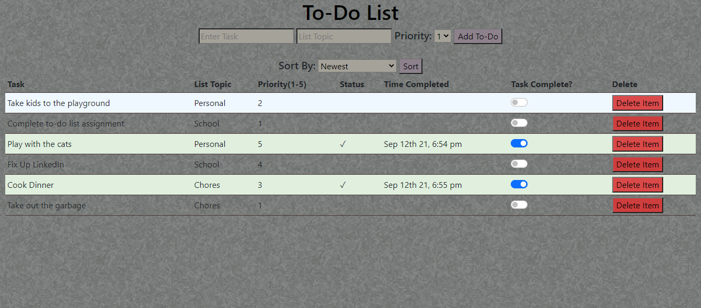

# Weekend SQL To-Do List

## Description

_Duration: 3 Day Sprint_

This is a calculator app that runs all of its logic on the server side and returns the solution back to the client.

## Checklist

See: https://github.com/hesscm/weekend-sql-to-do-list/wiki

## Screen Shot

Include one or two screen shots of your project here (optional). Remove if unused.

### Prerequisites

- Any IDE such as VS Code or a web browser, node.js, express, pg, and moment.

## Installation
1. Fork the repository
2. Ensure that [git is installed](https://git-scm.com/downloads) on your Mac/PC.
2. Copy the SSH link under 'Code'.
3. Enter terminal(Mac) or Git Bash(Windows) and in your desired folder, type 'git clone git@github.com:hesscm/weekend-sql-to-do-list.git'.
4. Open with your preferred IDE.
5. You will need node.js installed. In the repo folder, type "npm install" to install all of the included dependencies.
6. Type "npm start" to get the server running.
7. Run the app in the browser at "localhost:5000".

## Usage

1. Enter a task and/or the topic of the task, and choose a priority level.
2. Click the "Add To-Do" button to run your task.
3. Your task will appear. Use the toggle to let the list know that you have completed the task.
3a. You may hit the toggle again to mark the task incomplete.
5. The "Delete Item" button will delete the task. A warning will appear first.

## Built With

HTML, CSS, JavaScript, JQuery, Bootstrap, SweetAlert, node.js(with express, moment, and pg)

## Acknowledgement
Thanks to [Prime Digital Academy](www.primeacademy.io) who equipped and helped me to make this application a reality. (Shout out to Chris Black!)

## Support
If you have suggestions or issues, please email me at [chrishessmusic@gmail.com]